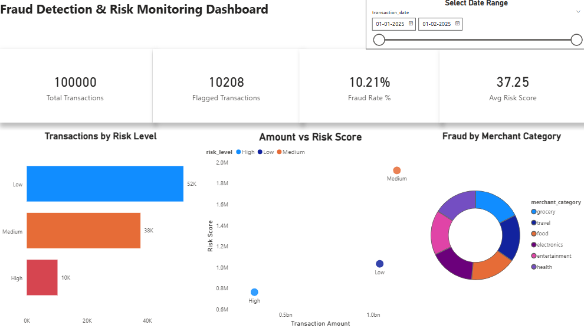

# 🏦 Fraud Detection & Risk Operations Dashboard

A business-first analytics project designed for Fraud Ops teams to monitor, detect, and mitigate financial risk through data-driven insights.

## 📈 Dashboard Preview



## 💡 Business Overview
In modern finance, manual fraud detection is slow and costly. This project provides a **rule-based fraud analytics solution** that identifies high-risk transactions in real-time, allowing operations teams to focus on the most critical threats.

### Problem Statement
Fraudulent activities result in significant financial losses and operational overhead. This dashboard solves the "Information Overload" problem by scoring every transaction based on risk rules, highlighting anomalies that require immediate attention.

## 📊 Key Performance Indicators (KPIs)
The dashboard tracks 4 critical metrics for fraud operations:
1. **Total Transactions**: Total volume of transaction data analyzed.
2. **Flagged Transactions**: Count of transactions triggered by risk rules.
3. **Fraud Rate %**: The percentage of high-risk transactions vs. total volume.
4. **Avg Risk Score**: A health metric representing the overall risk level of the transaction pool.

## 🛠️ Tech Stack
- **Power BI**: Data visualization, DAX modeling, and dashboard design.
- **Python (Pandas)**: Data engineering, cleansing, and risk-scoring pipeline.
- **Rule-Based Engine**: Each transaction is assigned a composite risk score based on amount anomalies, transaction velocity, and foreign transaction indicators

## 📂 Project Structure
```text
|
├── data/
|   ├── raw_transactions.csv
|   └── processed_transactions.csv
|
├── scripts/
|   ├── generate_data.py
|   └── fraud_rules.py
|
├── docs/
|   └── dashboard.png
|
├── Fraud_Detection_Risk_Dashboard.pbix
└── README.md
```

## 🚀 How to View the Dashboard
1. Ensure you have **Power BI Desktop** installed.
2. Download the `Fraud_Detection_Risk_Dashboard.pbix` file.
3. Open the file to view the interactive visualizations.
4. To refresh the data, ensure the source paths in Power BI point to `data/processed_transactions.csv`.

---
**End-to-end fraud analytics project designed and built for operational decision-making.*
*
